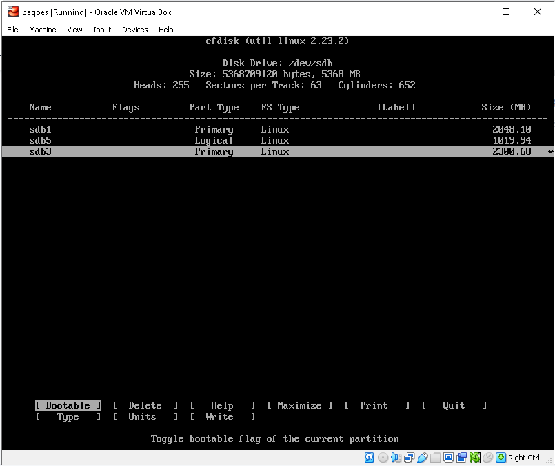
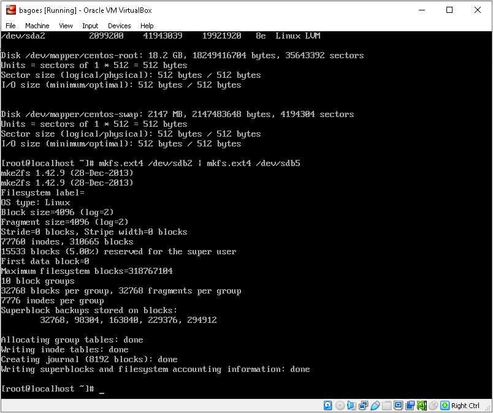

# ADMINISTRASI DAN KONFIGURASI LINUX (PARTISI DISK &  NFS)

* <mark style="color:yellow;">**Partisi Disk**</mark>

_Partisi disk_ merupakan proses membagi ruang _harddisk_ menjadi dua atau lebih sehingga

pengelolaan _harddisk_ lebih optimal. Berikut kita akan mencoba untuk melakukan _partisi disk_ pada

Centos 7 virtual yang telah kita buat sebelumnya.

1\. Pertama kita _login_ sebagai _super user_ terlebih dahulu. Masukkan perintah “_sudo su_” danmasukkan kata sandinya.

```
sudo su
```

2\. Selanjutnya kita cek _space_ memori _harddisk_ yang kita miliki dengan mengetikkan perintah

```
fdisk -l
```

<figure><figcaption></figcaption></figure>

3\. Disana kita bisa lihat ada 2 _file system_ yang terdeteksi. Selanjutnya kita akan membuat _virtual disk_ ke 2. Kita matikan terlebih dahulu _virtual_ linux yang berjalan dengan mengetikkan perintah

```
shutdown
```

4\. Selanjutnya pilih  VM nya kemudian klik setting pada bagian storage di IDE SATA klik add hardisk

<figure><figcaption></figcaption></figure>

5.Selanjutnya pilih pilih virtual hardisk pilih kapasitasnya dalam hal ini saya 5 gb

<figure><figcaption></figcaption></figure>

11\. Selanjutnya kita nyalakan _virtual machine_ linux centosnya dan login sebagai _root_ lalu kita cek

<figure><figcaption></figcaption></figure>

12\. Selanjutnya kita akan membuat partisi pada _disk_ baru yang telah kita buat tadi. ketik :&#x20;

```
cfdisk /dev/sdb
```

<figure><figcaption></figcaption></figure>

13\. Selanjutnya pilih _New_ pada partisi yang tertera “_<mark style="color:purple;">Free Space</mark>_”

14\. Selanjutnya kita akan diberi pilihan _primary_ atau _logical partition_. _Partisi primary_ adalah

partisi utama yang pertama kali diakses oleh computer saat melakukan _booting._ Sedangkan _partisi_

_logical_ adalah partisi sampingan yang di dalamnya tidak terdapat _file_ sistem operasi. Disini kita

akan membagi partisi _disk_ yang baru kita buat menjadi 3 bagian. Yaitu 2 GB untuk _primary,_ 2,3 GB

<figure><figcaption></figcaption></figure>

untuk _primary,_ dan 1 GB untuk _logical._ Pilih salah satu _primary_ atau _logical_ lalu _enter_ dan

masukkan _size_ dalam satuan MB yaitu 2048 MB = 2 GB. Berikutnya pilih _beginning._ Ulangi

langkah tersebut untuk partisi ke dua 1024 = 1 GB


15\. Berikutnya kita akan menentukan _file system_ pada partisi yang telah kita buat tadi.  kita pilih saja partisi yang akan di eksekusi lalu pilih _type_ dan masukan angka sesuai pilihan kemudian enter

<figure><figcaption></figcaption></figure>

17\. Setelah itu kita akan _format_ partisi yang telah kita buat tadi. Pilih salah satu partisinya lalu

pilih _write_ dan _enter._ Berikutnya akan muncul pesan peringatan dan ketikkan “_yes_” untuk lanjut

atau “_no_” untuk batal. Ulangi langkah tadi hingga ketiga partisi telah ter _format_.36

18\. Jika sudah kita pilih _quit_ dan _enter_

<figure><figcaption></figcaption></figure>

19\. Selanjutnya kita akan mengecek semua partisi pada _virtual disk_ linux yang kita punya.

Masukkan perintah “_fdisk –l_”.

<figure><figcaption></figcaption></figure>

20\. Selanjutnya kita perlu mengubah partisi sdb2 dan sdb5 kita agar bisa dibaca oleh linux.

Masukkan perintah “_mkfs.ext4 /dev/sdb2 | mkfs.ext4 /dev/sdb5_”. Perintah _mkfs_ berarti mengubah

_file system_ pada _device_ kita agar bisa dibaca oleh linux, _.ext4_ merupakan _file system 4rd extended._

Tanda “ | ” merupakan _pipe operator_ yang digunakan untuk menghubungkan _output_

```
mkfs.ext4 /dev/sdb2 |mkfs.ext4 /dev/sdb5
```

<figure><figcaption></figcaption></figure>

21\. Selanjutnya kita akan _mount_ partisi _sdb2_ dan _sdb5. Mount_ atau _mounting_ merupakan sebuah

proses menautkan _file system_ tambahan di atas _file system_ yang saat ini sedang berjalan .Sebelum kita _mount,_ kita akan membuat direktori terlebih dahulu. Untuk _sdb2_ kita beri direktori bernama _home2 dan sdb5 hom3_

```
mkdir home2 | mkdir home3
```

<figure><figcaption></figcaption></figure>

22\. Selanjutnya kita _mount_ partisi _sdb2_ ke direktori _home2_ dan partisi _sdb5_ ke direktori _home3._

```
mount /dev/sdb2 /home2 | mount mount /dev/sdb5 /home3
```

23\. Selanjutnya kita akan mengecek apakah sudah ter_mount_ atau belum. Masukkan perintah

“_lsblk_”.

<figure><figcaption></figcaption></figure>

24\. Pertama kita perlu mengetahui UUID pada partisi pada _sdb2_ dan _sdb5._ UUID (_Universally_

_Unique ID_) merupakan kode pengenal standar yang digunakan dalam proses pembuatan perangkat

lunak. Kita masukkan saja perintah “_blkid /dev/sdb2_” untuk _sdb2_ dan “_blkid dev/sdb5_” untuk _sdb5._

Perintah _blkid_ merupakan perintah yang digunakan untuk memetakan atau menampilkan atribut

blok pada perangkat.

```
blkid /dev/sdb2
blkid /dev/sdb5
```

<figure><figcaption></figcaption></figure>

25\. Lalu agar partisi yang kita _mount_ tadi tidak hilang pada saat _restart server,_ maka tambahkan

partisi baru pada _/etc/fstab_ dengan memasukkan perintah “_vi /etc/fstab_”. Perintah _vi_ merupakan

sebuah _text editor_ yang terdapat pada linux. Didalam _vi editor_ terdapat 2 _mode_ yaitu _mode_

_command_ dan _mode insert. Mode command_ merupakan _mode default_ dalam _vi editor_ dan tombol

_alphanumeric_ digunakan untuk menjalankan _command._ Sedangkan pada _mode insert,_ tombol

_alphanumeric_ digunakan untuk mengetik.

```
vi /etc/fstab
```

<figure><figcaption></figcaption></figure>

masukan UUID dari sdb2 dan sdb 5 dengan menggunakan tombol "i" untuk insert dan tombol "esc" untuk keluar ketik :wq kemudian enter

<figure><figcaption></figcaption></figure>

26. Berikutnya kita restart dan cek apakah sudah ter mounting otomatis

```
shutdown -r
lslbk
```

<figure><figcaption></figcaption></figure>

* <mark style="color:yellow;">**NFS (Network File System)**</mark>

NFS merupakan klien atau program server yang berjalan pada komputer sehingga memungkinkan user untuk mengakses file di jaringan dan memperlakukan mereka seolah-olah mereka berada di direktori file lokal. NFS ini berfungsi sebagai tempat penyimpanan data klien hampir mirip FTP. NFS umumnya menggunakan protokol RPC (Remote Procedure Call) yang berjalan di atas UDP dan membuka port UDP dengan port number 2049 untuk komunikasi antara klien dan server di dalam jaringan. Klien NFS akan mengimpor system berkas lokal kepada klien.

1. Pertama kita perlu mengatur ip address kita agar terhubung ke internet karena kita akan menginstall paket NFS dengan cara mendownload langsung ke internet. Dalam menginstall paket paket yang ada pada linux ada 2 cara yaitu download langsung dari internet atau lewat dvd installer yang sudah tersedia paket-paket di dalamnya. Karena linux yang kita jalankan memakai VM dari Virtual Box maka kita perlu menghubungkan perangkat asli kita ke internet dan mendapatkan ip nya. Cek dulu ip yang kita punya dengan membuka cmd (command prompt) pada windows dan ketikkan “ip a”.
2.

    <figure><figcaption></figcaption></figure>
3. Sekarang kita sudah mendapatkan IP Address, Subnet Mask, dan Default Gateway komputer atau laptop kita. Selanjutnya kita akan memberikan IP Address pada virtual linux kita. Pertama kita cek network adapter kita dengan memilih Edit virtual machine settings pada Virtual Box kita.
4. Pada VMWare terdapat beberapa model network connection, yaitu : NAT , Bridge ,Internal Network,Host only adapter ,Generic Driver , NAT network ,Cloud network
5.

    <figure><figcaption></figcaption></figure>
6. Pilih Network Adapter dan Network Connection nya pilih Bridge
7. Selanjutnya kita nyalakan vm linux kita. Lalu login dan cek network adapter yang terhubung ke vm linux kita dengan memasukkan perintah “<mark style="color:blue;">`nmcli d`</mark>”.
8.

    <figure><figcaption></figcaption></figure>
9. Disini adapter yang terhubung adalah enp0s3 Selanjutnya kita akan mengkonfigurasi ip address dengan memasukkan perintah “vi /etc/sysconfig/network-scripts/ifcfg- \[adapter kita]”.&#x20;
10. ```
    vi /etc/sysconfig/network-scripts/ifcfg-enp0s3
    ```
11. Selanjutnya kita akan mengedit&#x20;
12.

    <figure><figcaption></figcaption></figure>
13. Selanjutnya kita restart network kita agar ip dapat berubah. Dengan memasukkan perintah “systemctl restart network”.
14. ```
    systemctl restart network
    ```
15. Selanjutnya kita akan mengecek ip address yang kita buat tadi dengan memasukkan perintah “ip addr” atau “ip a”.
16.

    <figure><figcaption></figcaption></figure>
17. Berikutnya kita akan menginstall paket NFS dengan mengetikkan perintah:&#x20;
18. ```
    sudo yum install nfs-utils
    ```
19.

    <figure><figcaption></figcaption></figure>
20. Selanjutnya kita akan membuat folder yang akan di share kepada NFS Client dengan perintah
21. ```
    mkdir /home/sharingnfs
    ```
22. Selanjutnya kita akan setting permission dan mengubah kepemilikan folder&#x20;
23. ```
    chmod 777 /homesharingnfs | chown nfsnobody:nfsnobody /home/sharingnfs
    ```
24. Selanjutnaya kita akan enable dan start service nfs dengan memasukkan perintah berikut :&#x20;
25. ```
    systemctl enable rpcbind
    systemctl enable nfs-server
    systemctl enable nfs-lock
    systemctl enable nfs-idmap
    systemctl start rpcbind 
    systemctl start nfs-server
    systemctl start nfs-lock
    systemctl start nfs-idmap
    ```
26.

    <figure><figcaption></figcaption></figure>
27. Sekarang kita akan membagikan direktori NFS dengan menggunakan perintah&#x20;
28. ```
    vi /etc/exports
    ```
29.

    <figure><figcaption></figcaption></figure>
30. Setelah masuk ke editor masukkan : &#x20;
31. <pre><code>/home/sharingnfs 192.168.30.97/24(rw,sync,no_root_squash,no_all_squash)


    <a data-footnote-ref href="#user-content-fn-1">/home/sharingnfs</a> = Letak direktori yang akan di share.  
    <a data-footnote-ref href="#user-content-fn-2">192.168.30.97/24</a> = IP Address client yang diperbolehkan untuk mengakses direktori yang di share, bisa berupa network dan IP Address tertentu.  
    <a data-footnote-ref href="#user-content-fn-3">rw</a> = Hak akses share folder yang bersifat read dan write yang artinya bisa dibaca, diubah maupun di hapus.  
    <a data-footnote-ref href="#user-content-fn-4">sync</a> = Synchronize shared directory.  
    <a data-footnote-ref href="#user-content-fn-5">no_root_squash</a> = Root pada device client akan memiliki tingkat yang sama dalam mengakses file di device root pada server.  
    <a data-footnote-ref href="#user-content-fn-6">no_all_squash</a> = Enable user authority
    </code></pre>
32. Selanjutnya kita restart nfs server dengan perintah <mark style="color:blue;">`systemctl restart nfs-server`</mark>”.&#x20;
33. Setelah itu kita cek konfigurasi apakah folder yang di share berjalan dengan baik atau tidak dengan memasukkan perintah “<mark style="color:blue;">`exportfs -u`</mark>”.
34.

    <figure><figcaption></figcaption></figure>
35. Selanjutnya kita akan mengkonfigurasi firewall pada server nfs tuntuk memungkinkan client dapat mengakses folder yang di share pada nfs server dengan menjalankan perintah berikut. &#x20;
36. ```
    firewall-cmd --permanent --zone public --add-service mountd
    firewall-cmd --permanent --zone public --add-service rpc-bind
    firewall-cmd --permanent --zone public --add-service nfs
    firewall-cmd --reload
    ```
37.

    <figure><figcaption></figcaption></figure>
38. <mark style="color:yellow;">Selanjutnya kita akan konfigurasi NFS pada client</mark>. Kita copy saja 1 folder vm linux yang kita buat atau buat vm linux baru lalu kita cek network adapter nya dengan memasukkan perintah “<mark style="color:blue;">`nmcli d`</mark>”.
39.

    <figure><figcaption></figcaption></figure>
40. Disini adapter yang terhubung adalah enp0s3. Selanjutnya kita akan mengkonfigurasi ip address dengan memasukkan perintah&#x20;
41. ```
    vi /etc/sysconfig/network-scripts/ifcfg-enp0s3
    ```
42. Selanjutnya kita ubah IPADDR nya menjadi 192.168.30.97, save lalu exit.
43.

    <figure><figcaption></figcaption></figure>
44. Selanjutnya kita restart network kita agar ip dapat berubah
45. ```
    systemctl restart network
    ```
46. Selanjutnya kita akan mengecek ip address yang kita buat tadi dengan memasukkan perintah “ip addr” atau “ip a”.
47.

    <figure><figcaption></figcaption></figure>
48. Selanjutnya kita akan menginstall paket nfs dengan perintah&#x20;
49. ```
    yum install nfs-utils -y
    ```
50. Lakukan enable dan start service nfs dengan perintah berikut &#x20;
51. ```
    systemctl enable rpcbind
    systemctl enable nfs-server
    systemctl enable nfs-lock
    systemctl enable nfs-idmap
    systemctl start rpcbind
    systemctl start nfs-server
    systemctl start nfs-lock
    systemctl start nfs-idmap
    ```
52.

    <figure><figcaption></figcaption></figure>
53. Selanjutnya kita akan mengecek apakah folder yang di share oleh nfs server masih tersedia atau tidak dengan memasukkan <mark style="color:blue;">`showmount –e 192.168.30.97`</mark>
54.

    <figure><figcaption></figcaption></figure>
55.

    Sekarang kita sudah berhasil mengakses share dari server NFS pada VM dengan IP 192.168.30.97. Untuk memastikan bahwa share sudah ter-mount dengan benar, kita bisa mencoba untuk membuka direktori tersebut dan melakukan operasi file seperti biasa
56. Buat direktori di VM dengan IP 192.168.30.97 sebagai mount point untuk share dari server NFS.

    ```bash
    sudo mkdir /mnt/nfs-share
    ```


57. Mount share dari server NFS ke direktori yang baru saja dibuat dengan menjalankan perintah berikut:

    ```ruby
    sudo mount 192.168.30.241:/home/sharingnfs /mnt/nfs-share
    ```

    Di sini, 192.168.30.241 adalah IP address dari server NFS, /home/sharingnfs adalah direktori yang di-share, dan /mnt/nfs-share adalah direktori mount point yang baru saja dibuat.


58. Pastikan bahwa share sudah ter-mount dengan menjalankan perintah <mark style="color:yellow;">`df -h`</mark>. Jika share sudah ter-mount dengan benar, maka kita akan melihat informasi tentang share pada output perintah tersebut.


    <figure><figcaption></figcaption></figure>
59. Untuk membuat sharing NFS yang persisten,menambahkan entri ke berkas `vi /etc/fstab`.&#x20;

```ruby
192.168.30.24:/home/sharingnfs   /mnt/nfs-share   nfs   rw,sync   0   0
```

60. Penjelasan dari setiap bagian entri tersebut adalah sebagai berikut:

* `192.168.30.241:/home/sharingnfs` adalah alamat IP dari server NFS dan nama direktori yang akan dibagikan. Ganti dengan alamat IP dan nama direktori yang sesuai dengan konfigurasi Anda.
* `/mnt/nfs-share` adalah direktori di mana direktori yang dibagikan akan ditampilkan. Anda harus membuat direktori ini terlebih dahulu jika belum ada.
* `nfs` adalah jenis sistem file yang digunakan. Harus ditulis sebagai `nfs`.
* `rw` menandakan bahwa sistem file di-mount sebagai read/write (baca/tulis).
* `sync` menandakan bahwa file yang ditulis ke sistem file NFS harus dikonfirmasi terlebih dahulu sebelum ditulis ke disk.
* `0` menandakan bahwa filesystem ini tidak perlu di-backup oleh `dump`.
* `0` menandakan bahwa filesystem ini tidak perlu di-scan oleh `fsck` pada waktu booting.

Dengan menambahkan entri tersebut ke berkas `/etc/fstab`, sistem otomatis akan melakukan mount pada saat booting. Sehingga saat VM di-restart, konfigurasi sharing NFS akan tetap ada.


[^1]: 

[^2]: 

[^3]: 

[^4]: 

[^5]: 

[^6]: 
