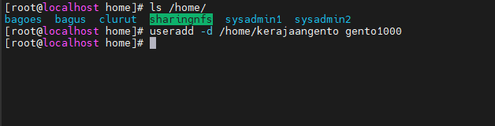
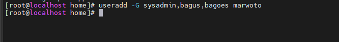
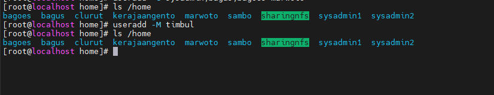
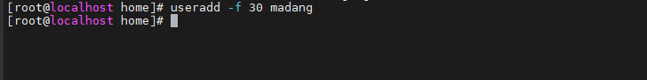

# ADMINISTRASI USER DAN GROUP

Linux mengenal 2 jenis user yaitu _<mark style="color:blue;">**user biasa (ditandai $)**</mark>_ dan _<mark style="color:blue;">**super user (ditandai #)**</mark>_. Untuk mengelompokkan user agar mudah dikelola, diperlukan grup-grup tersendiri.&#x20;

<mark style="color:yellow;">Manajemen User</mark>&#x20;

Daftar konfigurasi user dalam OS Linux terdapat pada file /etc/passwd yang mengandung informasi seperti nama user, password, UID, GUI, home directory dan shell.&#x20;

<figure><figcaption></figcaption></figure>

Perhatikan pada baris pertama ‘root:x:0:0:root:/bin/bash’ Artinya :

1. root = Nama user.
2. x = Berisi password yang telah di enkripsi yang disimpan dalam file /etc/shadow.
3. 0 = User ID.
4. 0 = User Group ID.
5. root = Info yang berisi nama lengkap user, alamat, telepon dan lainnya.
6. /root = Direktori kerja secara default ketika user login ke dalam sistem.
7. /bin/bash = Jenis shell yang dijalankan saat user login ke sistem. Cara Membuat User Berikut ada beberapa&#x20;

&#x20;      <mark style="color:yellow;">cara untuk membuat user</mark>

1. Membuat user dengan perintah adduser.&#x20;
2. Perintah ini secara otomatis akan membuat user dengan ketentuan-ketentuan yang telah ditentukan sistem secara _**default**_.&#x20;
3. Format perintahnya adalah <mark style="color:blue;">`adduser [nama_user]`</mark>. Contoh seperti berikut.
4.

    <figure><figcaption></figcaption></figure>
5. Membuat user dengan perintah useradd. Perintah ini hampir sama dengan adduser tetapi perintah useradd hanya akan membuat user yang berisikan nama user. Format perintahnya adalah <mark style="color:blue;">`useradd [nama_user`</mark>] dan untuk mengatur passwordnya gunakan perintah <mark style="color:blue;">`passwd {nama_user}`</mark>. Contohnya seperti berikut.
6.

    <figure><figcaption></figcaption></figure>
7. Membuat user dengan direktori tertentu. Jika kita ingin membuat user dengan nama direktori yang berbeda, maka kita bisa menambahkan <mark style="color:blue;">parameter –d</mark>. Seperti contoh berikut.
8.

    <figure><figcaption></figcaption></figure>
9. Membuat user dengan User ID & Group ID. Untuk membuat user dengan User ID tertentu kita bisa menambahkan option –u, sementara untuk membuat dengan Group ID tertentu kita bisa menambahkan option –g. Contohnya seperti berikut.
10.

    <figure><figcaption></figcaption></figure>
11. Membuat user ke dalam beberapa Group. Kita bisa membuat user yang masuk ke dalam beberapa group sekaligus. Opsi yang harus ditambahkan adalah –G \[nama\_group]. Berikut contohnya :
12.

    <figure><figcaption></figcaption></figure>
13. Membuat user tanpa membuat direktori kerja. Kita bisa membuat user tetapi tidak memiliki direktori kerjanya dengan menambahkan opsi – M. Contohnya.
14.

    <figure><figcaption></figcaption></figure>
15. Membuat Limit Batas Waktu user berdasarkan Tanggal. Kita bisa membuat user dengan membatasi limit berdasarkan waktu tertentu. Parameter yang digunakan adalah –e YYYY-MM-DD \[nama\_user]. Seperti contoh berikut.
16.

    <figure><figcaption></figcaption></figure>
17. Melimit Batas Waktu penggantian Password user. Kita bisa mengharuskan user untuk mengganti password dalam waktu tertentu dengan menambahkan opsi –f \[jumlah\_hari]. Seperti contoh berikut.
18.

    <figure><figcaption></figcaption></figure>
19. Memberikan komentar saat membuat user baru. Kita bisa memberikan komentar pada saat membuat user baru dengan menambahkan opsi –c “isi\_komentar”. Seperti contoh berikut.&#x20;
20.

    <figure><figcaption></figcaption></figure>
21. Cara Menghapus User :&#x20;

Untuk menghapus user kita menggunakan perintah userdel \[nama\_user]. File konfigurasi ketika menggunakan perintah userdel berada di <mark style="color:blue;">`/etc/login.defs`</mark>. Opsi –f akan menghapus user meskipun sedang dalam kondisi terkoneksi dengan sistem. Contoh seperti berikut.&#x20;

<figure><figcaption></figcaption></figure>

* <mark style="color:yellow;">Manajemen Group</mark>&#x20;

Lokasi penyimpanan daftar group dalam sistem terdapat dalam file <mark style="color:blue;">`/etc/group`</mark>.

* Cara Membuat Group Untuk membuat sebuah group kita bisa menggunakan perintah groupadd \[nama\_group]. Contoh.&#x20;

<figure><figcaption></figcaption></figure>

* Cara Menghapus Group Untuk menghapus sebuah group kita bisa menggunakan perintah groupdel \[nama\_group]. Contoh.&#x20;

<figure><figcaption></figcaption></figure>

* Menghapus grup yang sudah ada anggotanya masukkan perintah <mark style="color:blue;">`groupdel –f`</mark> operation.&#x20;
* Kita cek apakah group operation masih ada atau tidak dengan memasukkan perintah vi /etc/group.
* &#x20;Group operation sudah berhasil terhapus. Lalu bagaimana dengan usernya, apakah ikut terhapus? Maka kita cek dengan memasukkan perintah vi /etc/passwd.&#x20;
* Kita cari user odin dan yayat. Masih ada, lalu kita coba tes login. Kesimpulannya. Sebuah group yang didalamnya terdapat user jika dihapus groupnya, maka user tidak akan ikut terhapus. Cara memasukkan User ke dalam Group yang sudah ada Untuk memasukkan user ke dalam group yang sudah ada menggunakan perintah usermod. Contoh kita akan memasukkan user bayu ke dalam group gundar maka masukkan perintah usermod –a –G gundar bayu. Option –a (append) digunakan saat menambahkan user ke group baru. Jika tidak, user akan dihapus dari group manapun yang tidak terdaftar setelah –G. ADMINISTRASI CONTROL FILE Sebelum memulai administrasi permission file dan folder pada linux centos kita, mari kita lihat output dari perintah berikut. Kita akan melihat options yang digunakan :
* \= Tanda hubung. l = Untuk simbol “Link”. a = Untuk simbol “All”. Selanjutnya kita fokus pada 3 block output dari paling bawah. drwxr-xr-x. root root drwxr-xr-x. root root -rw-r--r--. root root Berikut penjelasannya : d = Menandakan objek tersebut adalah “Directory”. rwx = Menandakan permission pada directory diterapkan pada user. r-x = Menandakan permission pada directory diterapkan pada group. r-x = Menandakan permission pada directory diterapkan pada other. root = Yang pertama, menandakan pemilik dari direktori atau file. root = Yang kedua, menandakan group dari direktori dan file. Berikut merupakan permission yang berlaku untuk file dan directory. Octal Symbolic Permission Definition 1 x Execute Dapat masuk ke direktori dan mengakses file. 4 r Read Hanya dapat membaca file 2 w Write Dapat delete atau mengubah file di dalam direktori. Mengatur Permission pada File dan Direktori Ada 2 konsep dalam mengatur permission :

1. Symbolic Permission.
2. Octal Permission. Untuk lebih mudahnya lihat tabel berikut : Read Write Execute Octal 4 2 1 Symbolic r w x Contoh kita akan memberikan permission menggunakan metode octal, menggunakan 3 angka byte seperti 760. Angka 760 berarti owner = rwx, group = wx, other = tanpa permission. Direktori yang akan kita ubah permissionnya yaitu /home/ramean, maka masukkan perintah chmod 760 /home/ramean. Berikutnya kita akan memberikan permission menggunakan metode symbolic, untuk memberikan hak akses gunakan tanda + di ikuti oleh simbolnya sedangkan untuk menghapus hak akses gunakan tanda – di ikuti oleh simbolnya. Kita akan mencoba mencabut hak akses write pada group dan menambahkan hak akses write pada everyone untuk direktori /home/ramean, maka masukkan perintah chmod g-w /home/ramean | chmod w+o /home/ramean. Mengubah Kepemilikan File & Direktori Untuk mengubah kepemilikan suatu file dan direktori, kita dapat menggunakan perintah chown. Contoh kita akan mengubah kepemilikan direktori dari /home/ramean yang sebelumnya dimliki oleh user dan group root dan kita akan menggantinya dengan user dan group adam. Maka masukkan perintah chown adam:adam /home/ramean. Mengubah Kepemilikan Group File & Direktori Untuk mengubah kepemilikan group terhadap file atau direktori, kita dapat menggunakan perintah chgrp. Contoh kita akan mengubah kepemilikan group pada direktori /home/ramean yang sebelumnya dimiliki oleh group adam lalu kita akan menggantinya dengan root. Maka masukkan perintah chgrp root /home/ramean. MAINTENANCE LOG FILE Berikut ini beberapa file log dan kegunaannya : /var/log/messages : General log messages. /var/log/boot : System boot log. /var/log/debug : Debugging log messages. /var/log/auth.log : User login and authentication logs. /var/log/daemon.log : Running services such as squid, ntpd and others log message to this file. /var/log/dmesg : Linux kernel ring buffer log. /var/log/dpkg.log : All binary package log includes package installation and other information. /var/log/faillog : User failed login log file. /var/log/kern.log : Kernel log file. /var/log/lpr.log : Printer log file. /var/log/mail.\* : All mail server message log files. /var/log/mysql.\* : MySQL Server log file. /var/log/user.log : All user level logs. /var/log/xorg.0.log : X.org log file. /var/log/apache2/\* : Apache web server log files directory. /var/log/lighttpd/\* : Lighttpd web server log files directory. /var/log/fsck/\* : Fsck command log. /var/log/apport.log : Application crash report / log file. Untuk melihat file – file log tersebut bisa menggunakan beberapa perintah linux, diantaranya : Tail (melihat log yang terbaru atau paling bawah di daftar) : “tail –f /var/log/syslog”. More (melihat log secara lebih lengkap) : “more /var/log/syslog”. Cat (melihat log dengan tampilan standar) : “cat /var/log/file.err”. Less (melihat log per halaman atau ada jeda dibagi per layar) : “less /var/log/file.log”. Grep (melihat log dengan memberi filter kata yang di inginkan) : “grep –i fail /var/log/file.log”. Lastlog (pencatat log terakhir dengan menggunakan user tertentu) : “lastlog”. BACKUP & RESTORE Syntax : tar \[opsi] \[nama file] \[nama file atau direktori yang akan di compress] \[nama file atau direktori] Opsi : c = membuat sebuah arsip t = tampilan file pada arsip x = ekstrak dari arsip v = verbose (menampilkan nama file) z = kompres file (menggunakan gzip) f = nama perangkat atau nama file untuk menulis ke tujuan Backup Berikut cara backup di linux centos 7.
3. Pertama cari target yang akan di backup. Misalnya kita akan backup direktori /var/log/httpd maka buat direktori terlebih dahulu dengan masukkan perintah “mkdir /backup” lalu masuk ke direktori /var/log dengan menggunakan perintah “cd /var/log” lalu “tar cvf /backup/backup1 httpd/”.
4. Selanjutnya masuk ke direktori /backup untuk memastikan file backup sudah terbuat dengan menggunakan perintah “cd /backup && ls”. Restore Berikut cara restore file yang sudah di backup sebelumnya di centos 7.
5. Pertama kita masuk direktori /var/log dengan memasukkan perintah “cd /var/log” lalu hapus direktori httpd dengan menggunakan perintah “rm –rf httpd/”.
6. Selanjutnya buka direktori /backup lalu kita restore dengan memasukkan perintah “cd /backup” dan “tar xvf backup1 -C /var/log”.
7. Selanjutnya kita cek direktori /var/log apakah sudah ter restore atau belum dengan menggunakan perintah “cd /var/log && ls” dan “cd httpd && ls”. BASIC NETWORKING (OSI LAYER, STATIC ROUTING, VLAN, BONDING NETWORK) Networking merupakan sekumpulan komputer yang dapat saling berhubungan antara satu dengan lainnya, dengan menggunakan media komunikasi sehingga dapat saling berbagi data atau informasi. Jenis – jenis jaringan komputer :
8. LAN (Local Area Network) merupakan jaringan komputer yang meliputi area geografis yang kecil.
9. MAN (Metropolitan Area Network) merupakan jaringan komputer yang mencangkup area metropolitan.
10. WAN (Wide Area Network) merupakan jaringan komputer yang mencangkup area geografis yang luas. Tipe jaringan :
11. Jaringan Client Server merupakan jaringan yang terdapat server sebagai komputer yang menyediakan fasilitas bagi komputer – komputer lain di dalam jaringan tersebut dan terdapat client sebagai komputer yang menerima atau menggunakan fasilitas yang disediakan oleh server. Pada jaringan ini, manajemen datanya terpusat.
12. Jaringan Peer to Peer yaitu pada jaringan ini komputer – komputer yang terhubung bisa berperan sebagai server dan client dan berkomunikasi secara langsung. Pada jaringan ini, manajemen datanya tidak terpusat.
