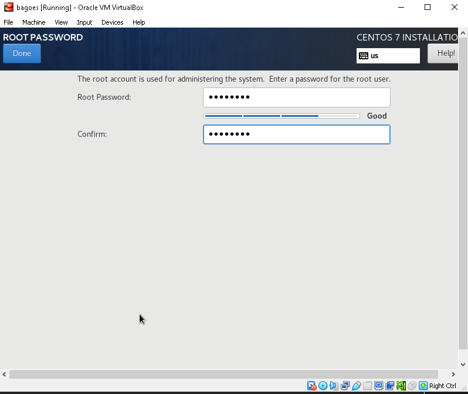

# INSTALASI CENTOS 7

INSTALLASI DAN KONFIGURASI LINUX SERVER CENTOS 7

Centos merupakan salah satu dari varian sistem operasi Linux. Centos Linux  Untuk ISO Linux Centos 7 bisa di download di [https://www.centos.org/download/](https://www.centos.org/download/)

1. Berikutnya kita pilih Install CentOS 7.
2. Tekan Enter untuk memulai Installasi.
3.

    <figure><figcaption></figcaption></figure>
4. Berikutnya kita akan memilih bahasa yang digunakan saat proses installasi. Pilih English (United States). Jika sudah klik Continue.
5.

    <figure><figcaption></figcaption></figure>
6. Berikutnya kita akan mengatur waktu dan zona waktu yang digunakan untuk server virtual,kita Pilih Date & Time.
7. Berikutnya atur Region menjadi Asia, City menjadi Jakarta,&#x20;

<figure><figcaption></figcaption></figure>

8. Berikutnya kita akan memilih Installation Destination yaitu lokasi installasi di drive mana yang akan dipilih. Secara default hanya tampil 1 drive&#x20;
9.

    <figure><figcaption></figcaption></figure>
10. Berikutnya kita akan mengatur Network & Hostname server virtual kita.
11.

    <figure><figcaption></figcaption></figure>
12. Jika sudah sesuai klik Begin Installation.
13.

    <figure><figcaption></figcaption></figure>
14. Selanjutnya kita akan mengatur Root Password. Klik Root Password. Lalu masukkanpasswordnya,
15.

    <figure><figcaption></figcaption></figure>
16. Selanjutnya kita akan membuat user untuk server virtual kita. Klik User Creation.
17. Selanjutnya masukkan Full Name user yang akan dibuat, Username, centang Require apassword to use this account
18. Jika sudah semua klik Finish configuration
19.

    <figure><figcaption></figcaption></figure>
20. Jika proses installasi sudah selesai klik Reboot.
21.

    <figure><figcaption></figcaption></figure>
22. Selanjutnya kita coba login dengan user yang sudah dibuat tadi. Masukkan username lalu klik enter atau jika ingin login menggunakan super user kita masukkan “su” untuk username dan root password yang sudah dibuat tadi sebelumnya.
23. Jika sudah berhasil login akan muncul nama@localhost jika login menggunakan user yang

<figure><figcaption></figcaption></figure>

<figure><figcaption></figcaption></figure>
