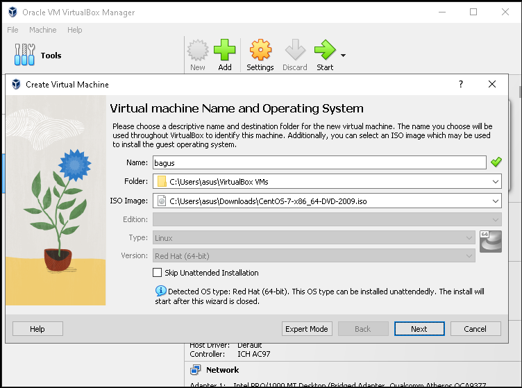
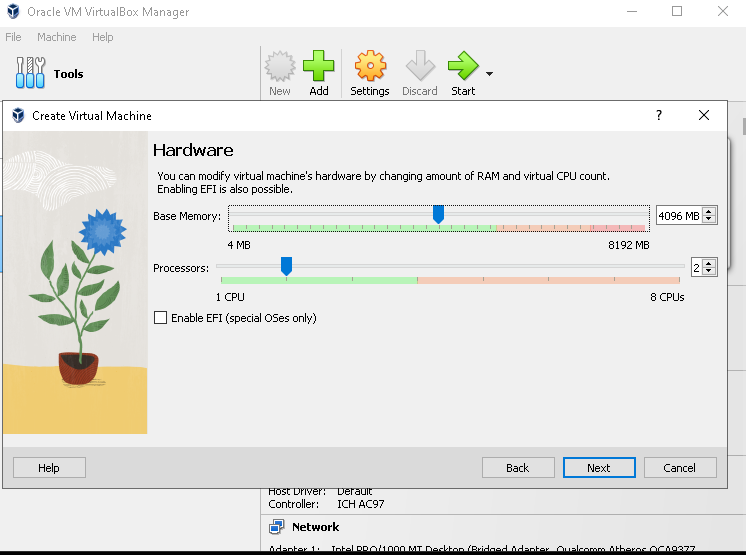
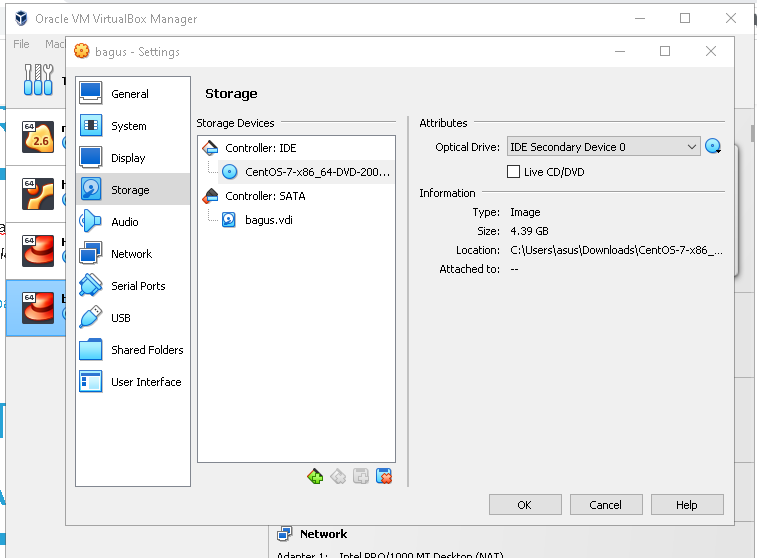

# INSTALASI VIRTUAL MESIN

INSTALLASI VM

Anda dapat mengunduh versi terbaru VirtualBox dari situs web Virtual Box: https://www.virtualbox.org/wiki/Downloads sesuai dengan versi sistem operasi Anda Windows, Mac atau Li

<figure><figcaption></figcaption></figure>

ikuti petunjuk instalasinya sampai selesai

<figure><figcaption></figcaption></figure>

buat baru VM masukan nama dan passwordnya

<figure><figcaption></figcaption></figure>

klik next , setting brapa CPU dan RAM yang dibutuhkan

<figure><figcaption></figcaption></figure>

terus klik next , pada setting di storage bagian IDE controler masukan ISO centos yang tadi sudah di download

<figure><figcaption></figcaption></figure>

