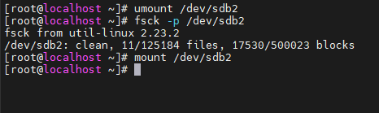
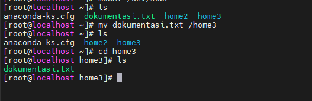
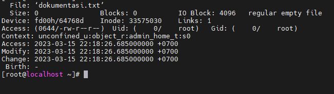
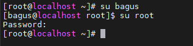
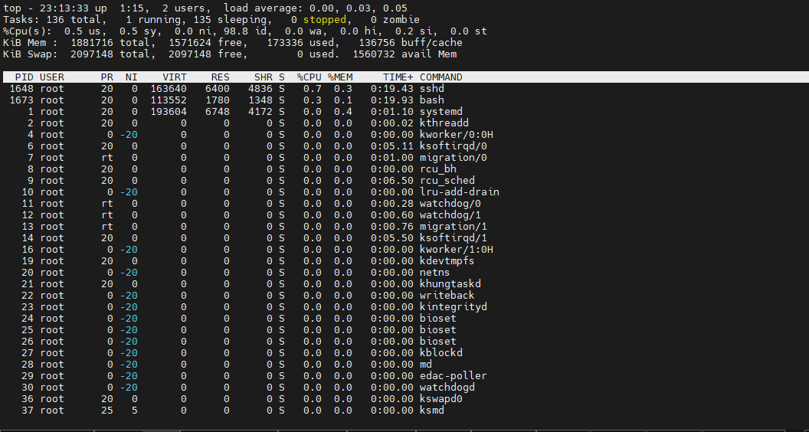
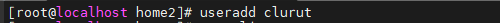
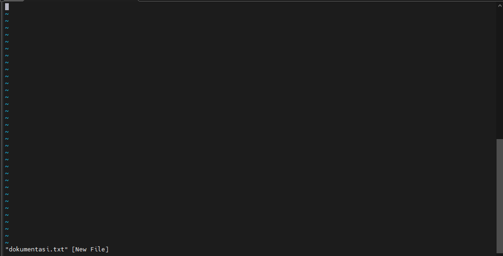

# PERINTAH DASAR LINUX

Berikut merupakan perintah dasar pada Linux Centos.&#x20;

<mark style="color:yellow;">**`alias`**</mark> = Perintah alias digunakan untuk mengatur perintah pintasan yang mudah di ingat untuk perintah yang lebih panjang dan mempersingkat waktu ketika bekerja pada baris perintah. Contoh : Kita punya perintah “<mark style="color:blue;">`ls -la`</mark>” lalu kita akan mengubahnya menjadi perintah “ll” maka kita memasukkan perintah alias ll=

<mark style="color:blue;">`ls -la`</mark>

<figure><figcaption></figcaption></figure>

<mark style="color:yellow;">**`apropos`**</mark> = Fungsi perintah ini adalah untuk mencari perintah-perintah atau file yang mengandung huruf yang dimaksud. Contoh :&#x20;

<mark style="color:blue;">`apropos manual`</mark>.&#x20;

<figure><figcaption></figcaption></figure>

<mark style="color:yellow;">**`cd`**</mark> = Fungsi perintah ini adalah untuk berpindah direktori atau mengganti direktori. Contoh : Kita akan coba untuk berpindah ke direktori /etc maka masukkan perintah&#x20;

<mark style="color:blue;">`cd /etc`</mark>

<figure><figcaption></figcaption></figure>

<mark style="color:yellow;">**`chmod`**</mark> = Berasal dari kata change mode. Chmod digunakan untuk merubah hak akses (permission) pada linux. Permission dapat berupa notasi numerik :&#x20;

0 (---) = No permission.&#x20;

1 (--x) = Execute.&#x20;

2 (-w-) = Write.&#x20;

3 (-wx) = Write dan Execute.&#x20;

4 (r--) = Read.&#x20;

5 (r-x) = Read dan Execute.&#x20;

6 (rw-) = Read dan Write.&#x20;

7 (rwx) = Read, Write dan Execute.

Contoh : Kita akan mengubah hak akses dari file dokumentasi.txt.&#x20;

Maka masukkan perintah <mark style="color:blue;">`chmod 777 dokumentasi.txt`</mark>

&#x20;Selain notasi numerik, permission dapat menggunakan notasi simbol :&#x20;

U = User.&#x20;

G = Group.

O = Other.&#x20;

R = Read.&#x20;

W = Write.&#x20;

X = Execute.&#x20;

Contoh : Kita akan mengubah hak akses other dari file dokumentasi.txt. Maka masukkan perintah&#x20;

<mark style="color:blue;">`chmod o-wx dokumentasi.txt`</mark>.&#x20;

chown = Berasal dari kata change owner. Digunakan untuk mengubah kepemilikan dari user atau grup pada sebuah file atau folder.&#x20;

Contoh : file dokumentasi.txt untuk owner bagus dan group sysadmin. Maka masukkan perintah&#x20;

<mark style="color:blue;">`chown bagus:sysadmin dokumentasi.txt`</mark>&#x20;

<figure><figcaption></figcaption></figure>

<mark style="color:yellow;">**`cp`**</mark> = Digunakan untuk copy file.&#x20;

Contoh : Kita akan meng copy file dokumentasi.txt ke folder /home/bagus/sysadmin maka masukkan perintah&#x20;

<mark style="color:blue;">`cp dokumentasi.txt /root/home3`</mark>

&#x20;

<figure><figcaption></figcaption></figure>

<mark style="color:yellow;">**df**</mark> = Digunakan untuk menampilkan total disk usage untuk filesystem yang telah termount.&#x20;

Contoh : Masukkan perintah <mark style="color:blue;">`df`</mark>&#x20;

<figure><figcaption></figcaption></figure>

<mark style="color:yellow;">**`exit`**</mark> = Digunakan untuk keluar dari login terminal atau sesi user yang berjalan.&#x20;

Contoh : Kita login menggunakan user bagus lalu kita akan logout atau keluar maka masukkan perintah <mark style="color:blue;">`exit`</mark>.

&#x20;

<figure><figcaption></figcaption></figure>

<mark style="color:yellow;">**`fdisk`**</mark> = Digunakan untuk memanipulasi tabel pada disk partition.&#x20;

Contoh : Masukkan perintah <mark style="color:blue;">`sudo fdisk –l`</mark>&#x20;

<figure><figcaption></figcaption></figure>

<mark style="color:yellow;">**`find`**</mark> = Digunakan untuk mencari file dalam hirarki direktori.&#x20;

Contoh : Kita akan mencari file dokumentasi.txt maka masukkan perintah <mark style="color:blue;">`find dokumentasi.txt`</mark>

<figure><figcaption></figcaption></figure>

<mark style="color:yellow;">**`fsck`**</mark> = Digunakan untuk mengecek dan memperbaiki sebuah file system linux.&#x20;

Contoh : Pertama kita unmount terlebih dahulu dengan memasukkan perintah <mark style="color:blue;">`umount /dev/sdb2`</mark> ,kita akan repair dengan memasukkan perintah <mark style="color:blue;">`fsck –p /dev/sdb2`</mark>,kita mount kembali dengan memasukkan perintah <mark style="color:blue;">`mount /dev/sdb2`</mark>

<figure><figcaption></figcaption></figure>

<mark style="color:yellow;">**`groupadd`**</mark> = Digunakan untuk membuat grup.&#x20;

Contoh : Kita akan membuat grup gento maka masukkan perintah <mark style="color:blue;">`groupadd gento`</mark>.&#x20;

<figure><figcaption></figcaption></figure>

<mark style="color:yellow;">**`ifdown`**</mark> = Digunakan untuk mematikan network interface secara manual.&#x20;

Contoh : Kita akan mematikan network interface enp0s3 maka masukkan perintah <mark style="color:blue;">`ifdown enp0s3`</mark>

<mark style="color:yellow;">**`ifup`**</mark> = Digunakan untuk menyalakan network interface secara manual.&#x20;

Contoh : Kita akan menyalakan network interface enp0s3 maka masukkan perintah <mark style="color:blue;">`ifup enp0s3`</mark>.&#x20;

<figure><figcaption></figcaption></figure>

<mark style="color:yellow;">**last**</mark> = Digunakan untuk melihat siapa yang login dan logout pada system kita.&#x20;

Contoh : Masukkan perintah <mark style="color:blue;">`last`</mark>.&#x20;

<figure><figcaption></figcaption></figure>

ls = Berasal dari kata list files. Digunakan untuk menampilkan isi dari direktori.&#x20;

Contoh : Masukkan perintah <mark style="color:blue;">`ls`</mark>.&#x20;

<figure><figcaption></figcaption></figure>

<mark style="color:yellow;">**`man`**</mark> = Digunakan untuk menampilkan manual pages pada suatu perintah.&#x20;

Contoh : Masukkan perintah <mark style="color:yellow;">`man ls`</mark>.

<figure><figcaption></figcaption></figure>

<mark style="color:yellow;">**`mount`**</mark> = Digunakan untuk mount file system.&#x20;

Contoh : Kita akan coba mount /dev/sdb2 maka masukkan perintah <mark style="color:blue;">`mount /dev/sdb2`</mark>.&#x20;

<mark style="color:yellow;">**`umount`**</mark> = Digunakan untuk unmount file system. Contoh : Kita akan coba unmount /dev/sdb2 maka masukkan perintah <mark style="color:blue;">`umount /dev/sdb2`</mark>.&#x20;

<figure><figcaption></figcaption></figure>

<mark style="color:yellow;">**`mv`**</mark> = Berasal dari kata move. Digunakan untuk memindahkan file dari suatu direktori ke direktori lain. Contoh : Kita akan memindahkan file dokumentasi.txt dari direktori /root/ ke /root/home3. Maka masukkan perintah <mark style="color:blue;">`mv dokumentasi.txt /home3`</mark>&#x20;

<figure><figcaption></figcaption></figure>

<mark style="color:yellow;">**`passwd`**</mark> = Digunakan untuk mengganti password user. Contoh : Kita akan mengganti password bagus maka masukkan perintah <mark style="color:blue;">`passwd bagus`</mark>.&#x20;

<mark style="color:yellow;">**`pwd`**</mark> = Digunakan untuk menampilkan di direktori mana kita berada.&#x20;

Contoh : Masukkan perintah <mark style="color:blue;">`pwd`</mark>.&#x20;

<figure><figcaption></figcaption></figure>

<mark style="color:yellow;">**`rm`**</mark> = Digunakan untuk menghapus file atau folder. Contoh : Kita akan menghapus file belajar.txt maka masukkan perintah <mark style="color:blue;">`rm dokumentasi.txt`</mark>.&#x20;

<mark style="color:yellow;">**`shutdown`**</mark> = Digunakan untuk mematikan sistem yang berjalan.&#x20;

Contoh : Masukkan perintah <mark style="color:blue;">`shutdown`</mark>.&#x20;

<mark style="color:yellow;">**`stat`**</mark> = Digunakan untuk menampilkan file atau file sistem status.&#x20;

Contoh : Kita akan menampilkan status file belajar.txt maka masukkan perintah <mark style="color:blue;">`stat dokumentasi.txt`</mark>.

<figure><figcaption></figcaption></figure>

<mark style="color:yellow;">**`su`**</mark> = Berasal dari kata switch user. Digunakan untuk mengganti user yang berjalan pada sistem.&#x20;

Contoh : Kita akan mengganti login menjadi user dinda maka masukkan perintah <mark style="color:blue;">`su bagus`</mark>.

&#x20;

<figure><figcaption></figcaption></figure>

sudo = Berasal dari kata super user do. Digunakan untuk mengganti user yang terdaftar dengan sudoers atau super user.&#x20;

Contoh : Kita akan coba login menggunakan akun super user maka masukkan perintah sudo su.&#x20;

<mark style="color:yellow;">**tar**</mark> = Berasal dari kata tape archive. Digunakan untuk mengkompress atau mengekstrak serangkaian file maupun direktori.&#x20;

Contoh : Kita punya direktori /sysadmin dan didalamnya ada file setoran, bunga dan kredit lalu kita akan mengkompress direktori finance tersebut.&#x20;

Maka masukkan perintah tar –cvf&#x20;

<mark style="color:blue;">`tar /root/home2`</mark>&#x20;

<figure><figcaption></figcaption></figure>

C = untuk membuat file .tar baru.&#x20;

V = menunjukkan deskripsi verbose dari proses kompresi.&#x20;

F = nama file.&#x20;

<mark style="color:yellow;">**`top`**</mark> = Digunakan untuk melihat program yang berjalan secara real-time.&#x20;

Contoh : kita akan melihat program yang dijalankan oleh user root maka masukkan perintah top –u root. Jika ingin keluar tekan tombol ctrl + c.&#x20;

<figure><figcaption></figcaption></figure>

uname = Digunakan untuk melihat informasi sistem.&#x20;

Contoh : Masukkan perintah uname.&#x20;

<figure><figcaption></figcaption></figure>

<mark style="color:yellow;">**useradd**</mark> = Digunakan untuk menambahkan user ke dalam sistem.&#x20;

Contoh : Kita akan membuat user baru bernama clurut maka masukkan perintah <mark style="color:blue;">`useradd clurut`</mark>.&#x20;

<figure><figcaption></figcaption></figure>

usermod = Digunakan untuk mengubah user di dalam sistem.&#x20;

Contoh : Kita akan memasukkan user clurut ke grup sysadmin maka masukkan perintah&#x20;

<mark style="color:blue;">`usermod –a –G finance clurut`</mark>.&#x20;

<figure><figcaption></figcaption></figure>

<mark style="color:yellow;">**vi**</mark> = Digunakan untuk membuka suatu file dengan text editor.&#x20;

Contoh : Kita akan membuka file bacaan.txt maka masukkan perintah <mark style="color:blue;">`vi dokumentasi.txt`</mark>.

&#x20;

<figure><figcaption></figcaption></figure>

<mark style="color:yellow;">**`who`**</mark> = Digunakan untuk mengetahui siapa saja yang login kedalam sistem. Contoh : Masukkan perintah <mark style="color:blue;">`who`</mark>.&#x20;

<figure><figcaption></figcaption></figure>

<mark style="color:yellow;background-color:yellow;">**`yum`**</mark> = Digunakan untuk menginstall, menghapus dan mengupdate paket paket dari distro linux.&#x20;

Contoh : Kita akan menginstall paket apache maka masukkan perintah <mark style="color:blue;">`yum install httpd -y`</mark>

<figure><figcaption></figcaption></figure>
