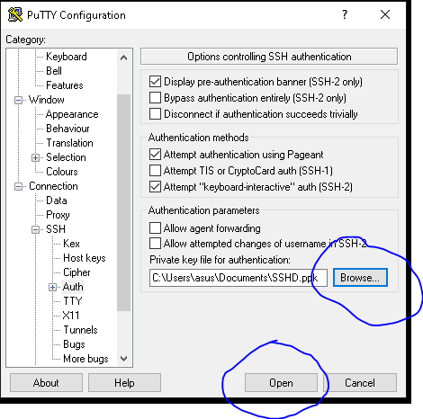

# SETTING NETWORK DI LINUX

IP Address. Untuk mengatur dan mengubah IP Address di Centos terdapat 2 cara yaitu GUI dan CLI. Selain itu, terdapat 2 jenis ip address yang akan di setting yaitu static (manual) dan dhcp (otomatis).&#x20;

1. Kita akan mengecek interface mana yang tersedia dan aktif dengan memasukkan perintah <mark style="color:blue;">`nmcli d`</mark>.
2.

    <figure><figcaption></figcaption></figure>
3. Lalu kita akan mengecek ip address dengan memasukkan perintah <mark style="color:blue;">`ip addr`</mark>.
4.

    <figure><figcaption></figcaption></figure>

&#x20;Setting IP Address dengan menggunakan mode CLI. <mark style="color:yellow;">Setting DHCP</mark>

1. Untuk mengatur ip address masukkan perintah
2. &#x20;<mark style="color:blue;">`sudo vi /etc/sysconfig/network-scripts/ifcfg-enp0s3`</mark>.
3. Lalu ganti BOOTPROTO=dhcp dan ONBOOT=yes.
4.

    <figure><figcaption></figcaption></figure>
5. Jika sudah, disimpan dan keluar lalu restart networknya dengan memasukkan perintah&#x20;
6. <mark style="color:blue;">`systemctl restart network`</mark>.&#x20;

<mark style="color:yellow;">Setting Static</mark>

1. Untuk mengatur ip address masukkan perintah&#x20;
2. <mark style="color:blue;">`vi /etc/sysconfig/network-script/ifcfg-ens33`</mark>.
3. Lalu ganti BOOTPROTO=static dan ONBOOT=yes dan tambahkan :&#x20;
4. IPADDR=192.168.30.153&#x20;
5. NETMASK=255.255.255.0&#x20;
6. GATEWAY=192.168.0.1&#x20;
7. DNS1=8.8.8.8&#x20;
8. DNS2=8.8.4.4
9. Jika sudah, disimpan dan keluar lalu restart networknya dengan memasukkan perintah&#x20;
10. <mark style="color:blue;">`systemctl restart network`</mark>.&#x20;
11.

    <figure><figcaption></figcaption></figure>

<mark style="color:yellow;">Setting IP Address dengan menggunakan Mode GUI 1</mark>

1. Masukkan perintah nmtui.
2.

    <figure><figcaption></figcaption></figure>
3. Lalu pilih edit a connection.
4. Pilih enp0s3 dan pilih edit.
5.

    <figure><figcaption></figcaption></figure>
6. Lalu ubah addresses, gateway dan dns server seperti contoh berikut lalu pilih ok.
7.

    <figure><figcaption></figcaption></figure>
8. Jika sudah, quit dari nmtui.
9. Selanjutnya restart network dengan cara <mark style="color:blue;">`systemctl restart network`</mark>.
10.

    <figure><figcaption></figcaption></figure>

<mark style="color:yellow;">REMOTE LINUX MENGGUNAKAN SSH</mark>&#x20;

SSH atau Secure Shell adalah aplikasi untuk remote login yang jauh lebih aman. Fungsi utama aplikasi ini adalah untuk mengakses mesin secara remote, biasanya remotenya menggunakan putty sebagai ssh client atau yang lainnya.

1. Pada saat installasi Centos 7 aplikasi SSH sudah terinstall di dalamnya, kita tinggal menggunakannya saja. Bisa di cek dengan memasukkan perintah “<mark style="color:blue;">`systemctl status sshd`</mark>” dan pastikan statusnya active dan running.
2.

    <figure><figcaption></figcaption></figure>
3. Berikutnya kita akan melihat status service SSH di firewalld, maka masukkan perintah <mark style="color:blue;">`firewall-cmd --list-services.`</mark>
4.

    <figure><figcaption></figcaption></figure>
5. Buka aplikasi Kitty lalu masukka ip address vm linux centos kita lalu pilih ssh dan klik open.
6.

    <figure><figcaption></figcaption></figure>
7. Jika muncul pesan peringatan pilih accept.
8.

    <figure><figcaption></figcaption></figure>
9. Selanjutnya login menggunakan user bagoes
10.

    <figure><figcaption></figcaption></figure>

<mark style="color:yellow;">Mematikan akses login sebagai root.</mark>

1. Selanjutnya kita akan mencoba mematikan akses login sebagai root pada Kitty. Pertama kita perlu mengubah file utama konfigurasi ssh yaitu sshd\_config.&#x20;
2. Tetapi sebelum mengubah, ada baiknya kita untuk membackup terlebih dahulu file tersebut dengan memasukkan perintah <mark style="color:blue;">`cp /etc/ssh/sshd_config /etc/ssh/sshd_config.backup`</mark>.
3. Selanjutnya kita buka file nya dan ubah : PermitRootLogin no PermitEmptyPassword no
4.

    <figure><figcaption></figcaption></figure>
5. Jika sudah di save lalu restart service sshd dengan memasukkan perintah <mark style="color:blue;">`systemctl restart sshd`</mark>.
6. Selanjutnya kita akan coba login menggunakan akun root di Kitty.&#x20;
7.

    <figure><figcaption></figcaption></figure>

<mark style="color:yellow;">Mengganti port SSH</mark>&#x20;

Secara default port SSH menggunakan port 22 selanjutnya kita akan coba ganti dengan menggunakan port 9999, dengan mengganti default port SSH maka orang lain tidak akan tau berapa port yang digunakan SSH pada server kita.

1. Buka file sshd\_config dengan memasukkan perintah vi /etc/ssh/sshd\_config.
2. Cari tulisan Port 22 ubah menjadi <mark style="color:blue;">`2200`</mark> lalu simpan.
3. Selanjutnya restart service sshd dengan memasukkan perintah <mark style="color:blue;">`systemctl restart sshd`</mark>.
4. Selanjutnya izinkan port 49159 di firewalld dengan memasukkan perintah <mark style="color:blue;">`firewall-cmd --add-port=2200/tcp –permanent firewall-cmd --reload firewall-cmd –list-port`</mark>
5. Selanjutnya kita akan coba login menggunakan port 22 dan 2200. Port 22 Port 2200&#x20;
6.  Untuk menambahkan port SSH ke firewall pada CentOS  Anda dapat menjalankan perintah berikut:

    ```css
    sudo firewall-cmd --add-port=2200/tcp --permanent
    ```

    Perintah di atas akan menambahkan port 2200 TCP ke firewall CentOS 7 Anda. Jika Anda menggunakan port SSH yang berbeda, gantilah nomor port tersebut dengan port yang Anda gunakan.

<mark style="color:yellow;">Membuat SSH Key</mark>&#x20;

Berikutnya kita akan mencoba membuat ssh key yang nantinya ketika kita akan remote ke server kita login menggunakan key.

1. Pertama login menggunakan user biasa dan masukkan perintah <mark style="color:blue;">`ssh-keygen –t rsa`</mark>.&#x20;
2. Untuk no 1 tekan ‘enter’, no 2 ‘masukkan password’, no 3 ‘ketik ulang password’.
3.

    <figure><figcaption></figcaption></figure>
4. Setelah kita generate ssh key nya, kita akan mendapat 2 key pada direktori /root/.ssh. 2 key tersebut adalah <mark style="color:red;">id\_rsa (private key)</mark> dan <mark style="color:red;">id\_rsa.pub (public key)</mark>.
5.

    <figure><figcaption></figcaption></figure>
6. Yang akan digunakan oleh client adalah private key dan yang digunakan oleh server adalah public key. Kedua kunci tersebut harus pair antara client dan server. Selanjutnya kita akan copy ke direktori /root/ private key nya.&#x20;
7. Masukkan perintah <mark style="color:blue;">`cp .ssh/id_rsa /root/`</mark>.
8.

    <figure><figcaption></figcaption></figure>
9. Selanjutnya kita akan merename public key dengan nama authorized\_keys. Dimana server akan mengecek file bernama authorized\_keys sesuai dengan konfigurasi di sshd\_config.&#x20;
10. Maka masukkan perintah <mark style="color:blue;">`mv .ssh/id_rsa.pub /root/.ssh/authorized_keys`</mark>. Lalu masukkan perintah&#x20;
11. <mark style="color:blue;">`chmod 600 /root/.ssh/authorized_keys`</mark>.
12. Selanjutnya kita akan mendownload file key id\_rsa yang berada pada /home/adam/ menggunakan aplikasi WinSCP. Buka aplikasi WinSCP lalu ubah pengaturan berikut.&#x20;
13. File Protocol = SCP&#x20;
14. Host name = IP Address Server&#x20;
15. Port number = 22&#x20;
16. Username = User login&#x20;
17. Password = Password login Lalu Klik Login.
18.

    <figure><figcaption></figcaption></figure>
19. Setelah masuk pada home direktori, klik kanan pada file id\_rsa lalu pilih download.
20.

    <figure><figcaption></figcaption></figure>
21. Setelah kita download file id\_rsa selanjutnya kita akan generate file tersebut menggunakan aplikasi Puttygen. Buka aplikasi Putty Key Generator lalu klik load.
22.

    <figure><figcaption></figcaption></figure>
23. Jika sudah, masukkan file id\_rsa yang telah kita download tadi. Lalu masukkan password yang sama dengan yang sebelumnya pada saat kita generate ssh key lalu klik ok.
24.

    <figure><figcaption></figcaption></figure>
25. Jika passwordnya sama maka akan sukses. Klik ok.
26. Selanjutnya kita simpan file key yang baru dengan nama ssh\_cert. Klik tombol save private key.
27.

    <figure><figcaption></figcaption></figure>
28. Selanjutnya kita tes login dengan membuka aplikasi Kitty lalu masuk pada bagian SSH lalu pilih Auth kemudia klik browse dan pilih file ssh\_cert yang sebelumnya kita generate kemudian klik open.
29.

    <figure><figcaption></figcaption></figure>
30. Selanjutnya coba login dan masukkan passwordnya. Jika sukses akan seperti berikut.&#x20;
31.

    <figure><figcaption></figcaption></figure>
32. Dengan menggunakan key, kegiatan remote session dari sisi client ke server yang letaknya berjauhan akan lebih secure.
33.

    <figure><figcaption></figcaption></figure>
